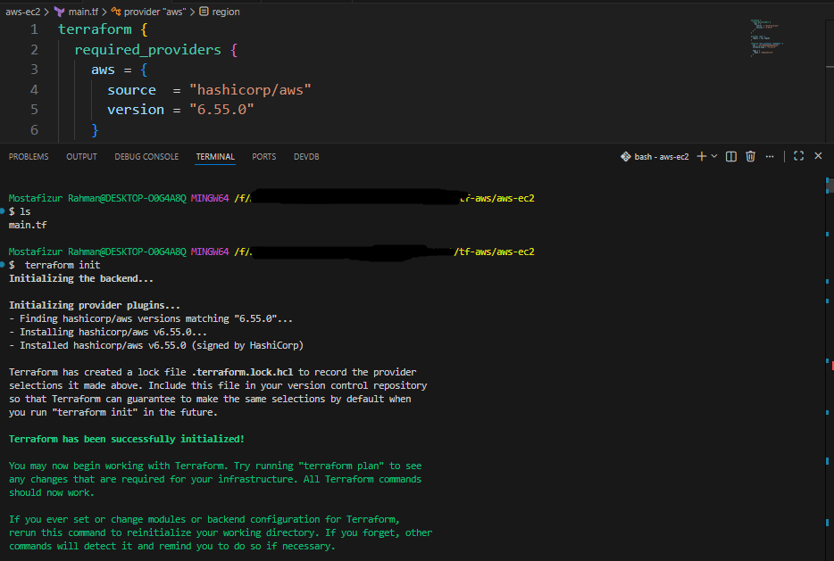
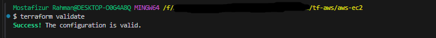
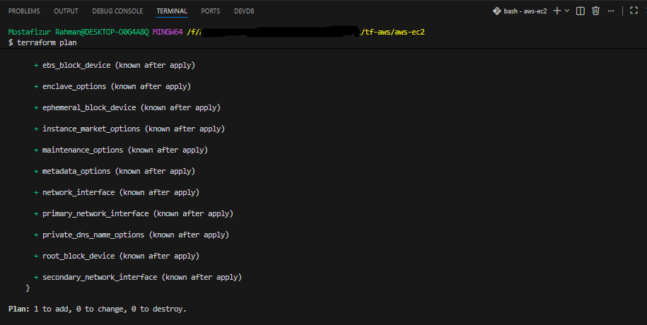
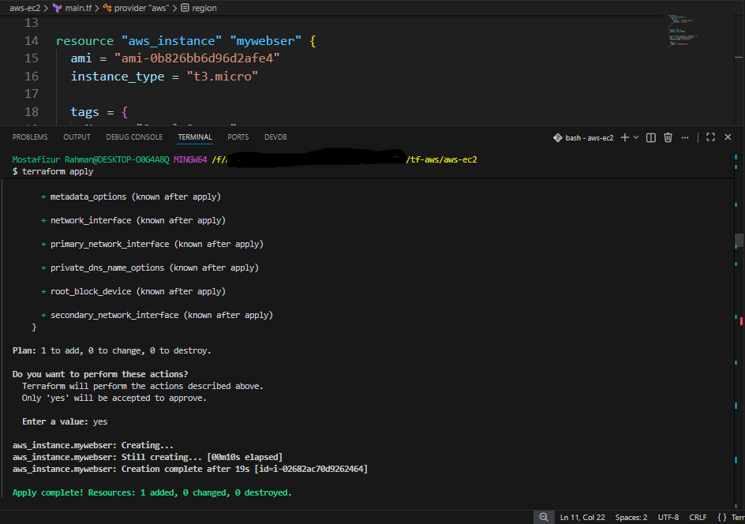
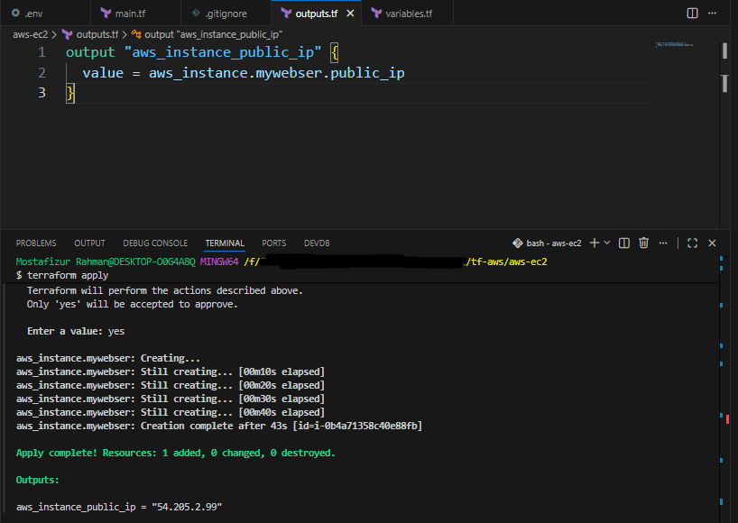
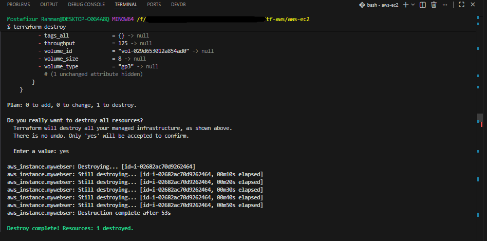

# Terraform AWS EC2 Instance
This project demonstrates how to provision an Amazon EC2 instance using Terraform.
It is part of my AWS & Terraform learning journey.

---

## Technologies
- Terraform
- AWS EC2
- AWS Provider
- HCL (HashiCorp Configuration Language)

---

## Project Structure
main.tf
variables.tf
outputs.tf
README.md
.gitingnore
screenshots/


---

## Resources Created

- EC2 Instance
- AWS Provider Configuration in main.tf

---

## Variables

| Name   | Description         |
|--------|---------------------|
| region | The value of region |


---

## Outputs
- Public IP

---

## Commands
Initialize Terraform

```bash
terraform init
```

Validate configuration

```bash
terraform validate
```

Preview changes

```bash
terraform plan
```

Create resources

```bash
terraform apply
```

Destroy resources

```bash
terraform destroy
```

---

## Screenshots

### Terraform Init


### Terraform Validate


### Terraform Plan


### Terraform Apply


### Terraform Output


### AWS Console


### Terraform Destroy


---

## Learning Outcomes
- Configure AWS Provider
- Create EC2 instances
- Use input variables
- Use output values
- Validate Terraform configuration
- Understand Terraform Basic workflow
- Destroying any unnecessary EC2 instance

---

## Author
Md. Mostafizur Rahman
GitHub: https://github.com/perfectionist1